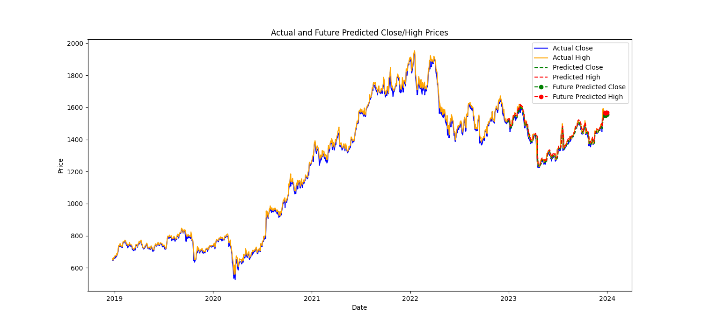

# Stock Predictor with Neural Network

## Overview

This repository contains a stock prediction system utilizing neural network technology. The model is designed to forecast future stock prices based on historical data. It is currently configured with a 5-year dataset of Infosys (INFY.NS), but you can easily replace it with data from different companies.

## Features

- Neural network implementation for stock price prediction.
- Utilizes historical stock data for training and testing.
- Easy-to-use interface for predicting future stock prices.

## Technologies Used

- Python
- TensorFlow
- Jupyter Notebooks (for experimentation)
- TA-Lib (technical indicators)

## Getting Started

### Prerequisites

- Python installed (version 3.11.5)
- Jupyter Notebook for running and experimenting with the code (optional)

### Installation

1. Clone the repository:

   ```bash
   git clone https://github.com/your-username/StockPredictor-NeuralNet.git
   ```

2. Install dependencies:

   ```bash
   pip install -r requirements.txt
   ```

3. Download Historical Stock Data:

   - Visit the Yahoo Finance link for the historical data: [Yahoo Finance - INFY.NS Historical Data](https://finance.yahoo.com/quote/INFY.NS/history/)
   - Download the historical data as a CSV file.

4. Replace Dataset:

   - Replace the existing dataset file ('INFY.NS-3.csv') in the repository with your downloaded CSV file.
   - Update the filename in the code accordingly.

### Usage

1. Input historical stock data.
2. Train the neural network.
3. Predict future stock prices.

**Note:** Predicting stock market prices is a risky game because it not only depends on previous data but also on current market conditions, weather, politics, and other unpredictable factors.



For detailed insights into the modified process for stock market prediction using Long Short-Term Memory (LSTM), refer to [Predicting_Stock_Market_Movements_Using_Long_Short-Term_Memory_LSTM.pdf](Predicting_Stock_Market_Movements_Using_Long_Short-Term_Memory_LSTM.pdf).


### Example with Different Companies

1. Download historical stock data for the desired company from Yahoo Finance.
2. Replace the existing dataset file in the repository with the new CSV file.
3. Update the filename in the code to match the new dataset.
4. Run the application and observe the predictions for the new company.

## Contributing

Contributions are welcome! If you find any issues or have suggestions for improvements, feel free to open an issue or create a pull request.

## License

This project is licensed under the [MIT License](LICENSE).

